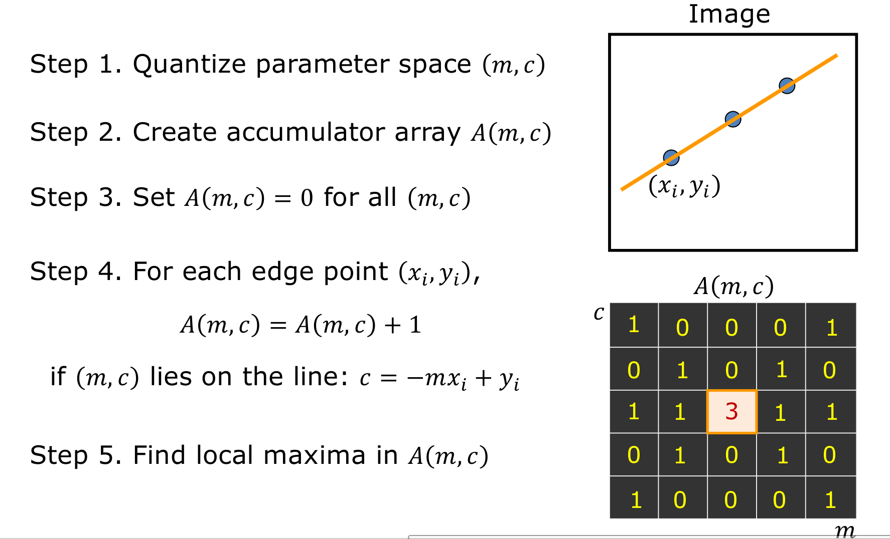

# Lane Lines Detection

<a href="https://youtu.be/qxJfXvgMZw4?si=p56K6Thoya-TY_9y"></a>

## Overview

When we drive, we use our eyes to decide where to go. The lines on the road that show us where the lanes are act as our constant reference for where to steer the vehicle. Naturally, one of the first things we would like to do in developing a self-driving car is to automatically detect lane lines using an algorithm.


In this project, I detected lane lines in images using Python and OpenCV. OpenCV, Open-Source Computer Vision, is a package that has many useful tools for analyzing images.

Here's how I navigated through this project:
* Color Selection
* Region of interest Selection
* Grayscaling
* Gaussian Smoothing
* Canny Edge Detection
* Hough Tranform

Everything is pretty simple aside from the technique used to find the line from the edges, Hough Transform.

## Hough Transform

This project utilizes the Hough Transform, a powerful image processing technique, to identify lane lines in road images. Here's a breakdown of its key features:

### Concept: 
The Hough Transform identifies lines and shapes based on their geometric properties in an image. In our case, we're interested in lines, so the transform maps edge points in the image to lines in a parameter space.


### How it works:

* **Edge detection:** Edges in the image, potentially corresponding to lane lines, are identified.
*  **Parameter space mapping:** For each edge point, the transform considers different potential lines passing through it. Each line is represented by its parameters (e.g., slope and intercept).
*  **Accumulation:** Votes are accumulated in the parameter space for each possible line based on the edge points that support it.
*  **Peak detection:** Lines with high vote counts in the parameter space are identified as likely lane lines.



### Implementation in this project:

*  This project leverages the Hough Transform to detect lines in road images, potentially corresponding to lane lines.
*   Specific parameters and thresholds may be adjusted for optimal performance on your image dataset.
 
## User Guide

### 1. Python Environment:

*   **Requirement:** Python 3 with libraries: numpy, matplotlib, OpenCV, and Jupyter Notebook.
*   **Recommendation:** Anaconda Python 3 distribution due to its prepackaged dependencies and widespread use in data science. Download the appropriate package from [https://www.continuum.io/downloads](https://www.continuum.io/downloads).
*   **Alternative:** If Anaconda is already installed with Python 2, create a separate Python 3 environment using the provided command.

### 2. OpenCV Installation:

*   **Verification:** Ensure you are operating in the Python 3 environment using the command `python --version`.
*   **Installation:** Execute the following commands at the terminal prompt:
    
     ```pip install pillow```
     
     ```conda install -c https://conda.anaconda.org/menpo opencv3```
    
-   **Testing:** Verify installation by running `python` followed by `import cv2` and exiting with Ctrl-d.

### 3. Moviepy Installation:

-   **Purpose:** Video processing in the project (alternative packages are viable).
-   **Installation:** Use the command `pip install moviepy`.
-   **Verification:** Test installation with `python`,  `import moviepy`, and exiting with Ctrl-d.

### 4. Jupyter Notebook:

-   **Introduction:** Project completion environment. If unfamiliar, utilize the referenced learning resource.
-   **Functionality:** IPython notebook allowing interactive code execution and result visualization.
-   **Opening:** Ensure you are in the Python 3 environment and execute the command `jupyter notebook`.
-   **Accessing Project:** Click on the file named "P1.ipynb" in the browser window.
-   **Instructions:** Follow the instructions within the notebook to proceed with the project.
